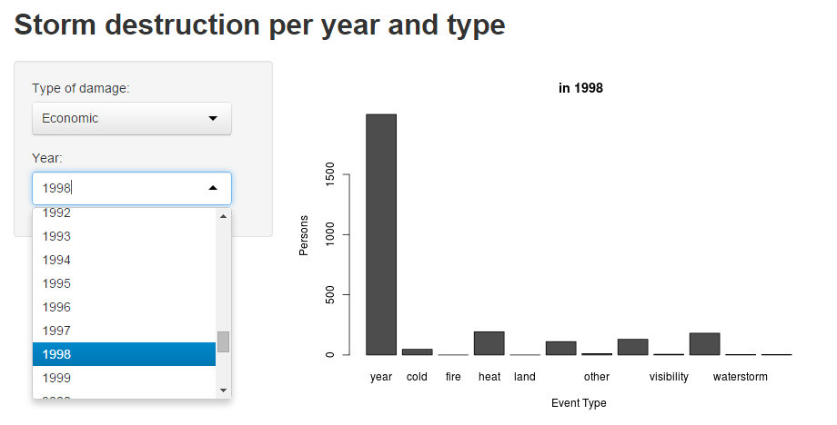

## Description

This is my Slidify presentation for a Storm Destruction analysis app I wrote in Shiny. The app was written as a submission for the 'Developing Data Products' Course Project of the so-titled Coursera course, made by John Hopkins University.

---
## Details

The data was taken from the NOAA Storm Database. The database tracks characteristics of major storms and weather events in the United States, including when and where they occur, as well as estimates of any fatalities, injuries, and property damage. 

Building further upon my project submission for 'Reproducible Research' the data is aggregated, event types are grouped, and an interactive bar graph showing damage of a type and year (given by user input) is produced.

```{r head-10-lines, echo=TRUE, results='hide',warning=FALSE}
total_economicdamage_peryear <- read.csv("total_economicdamage_peryear.csv", sep=",", header=T)
total_fatalities_peryear <- read.csv("total_fatalities_peryear.csv", sep=",", header=T)
total_injuries_peryear <- read.csv("total_injuries_peryear.csv", sep=",", header=T)

#setting the data straight
damageyear <- merge(total_economicdamage_peryear[,-1],total_fatalities_peryear[,-1],by=(c("year","event_class")))
damageyear <- merge(damageyear,total_injuries_peryear[,-1],by=(c("year","event_class")))
colnames(damageyear) <- c("year","event_class","eco","fat","injuries")
evtypes <<- sort(unique(damageyear$event_class))
```

---
## Example
The data was written into three csv files which were read in and melted using dcast from the package 'melt', with melted values being the economic damage, injuries or casulties resulting from weather events.



---
## To-do's
- Aggregation: Instead of year per year, use a slider to select desired years and sum up the data.
- Mapping: a package for a US map exists, so this can be implemented. The data can be shown per state as a heatmap of some sort.
- Splitting: Weather event types should be checked and combined with a checkbox, and the data can be summed up like this. 


---
## Conclusion

- Having performed the project a while after the quizzes and doing 3 courses at the same time, I've noticed I had trouble remembering where and how to do Shiny and Slidify things. Basic stuff needed repeating, and this course project made me do it, which is pretty good actually.
- Further improvements are easily made once the groundwork for Shiny and Slidify are layed out and after a bit of experience. 
- My job centers around sparse high-dimensional data which often is very difficult to visualize or get an intuitive grasp on. I can start using this know-how to make the data at my job stand out.
- Once basic levels of Markdown, Shiny and Slidify are known, it all reverts back to the same skill: abstract Googling skills.